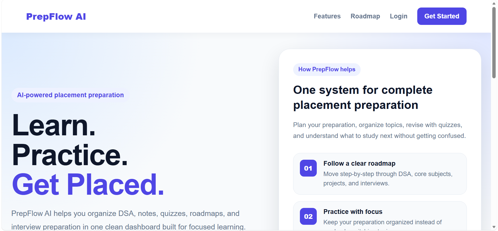

# 🚀 PrepFlow AI



PrepFlow AI is a placement preparation platform designed to help students organize, track, and manage their learning journey from a single dashboard.

The goal of PrepFlow AI is to provide a structured system for placement preparation by combining roadmaps, progress tracking, notes management, and future AI-powered learning tools into one platform.

---

## ✨ Current Features

### 🔐 Authentication

* User Registration
* User Login
* Secure Password Hashing with bcrypt
* JWT-based Authentication

### 📊 Dashboard

* Personalized Dashboard
* User Overview
* Preparation Goals
* Progress Summary
* Suggested Learning Paths

### 👤 User Profile

* Profile Management
* Preparation Information Storage
* Target Company Tracking

### 🎨 Modern UI

* Responsive Design
* Mobile-Friendly Layout
* Reusable Theme System using CSS Variables
* Clean Dashboard & Landing Page

---

## 🛠️ Tech Stack

### Frontend

* React
* React Router
* CSS3
* Vite

### Backend

* Node.js
* Express.js

### Database

* MongoDB Atlas
* Mongoose

### Authentication

* JWT
* bcrypt.js

### Deployment

* Vercel (Frontend)
* InfinityFree (Backend)

---

## 📂 Project Structure

```bash
PrepFlow-AI
│
├── frontend
│   ├── src
│   │   ├── components
│   │   ├── pages
│   │   ├── layouts
│   │   ├── services
│   │   └── styles
│
├── backend
│   ├── controllers
│   ├── models
│   ├── routes
│   ├── middleware
│   ├── config
│   └── utils
│
└── README.md
```

---

## ⚙️ Installation

### Clone Repository

```bash
git clone https://github.com/YOUR_USERNAME/prepflow-ai.git
```

### Frontend Setup

```bash
cd frontend
npm install
npm run dev
```

### Backend Setup

```bash
cd backend
npm install
npm run dev
```

---

## 🔑 Environment Variables

Create a `.env` file inside the backend folder:

```env
MONGO_URI=your_mongodb_connection_string
JWT_SECRET=your_jwt_secret
PORT=5000
```

**Do not commit your actual credentials to GitHub.**

---

## 🎯 Project Goals

PrepFlow AI aims to become a complete placement preparation platform with:

* Learning Roadmaps
* Progress Tracking
* Notes Management
* AI-Powered Quiz Generation
* AI Study Assistance
* Interview Preparation Tools
* Personalized Recommendations

---

## 👨‍💻 Author

**Aditya Sharma**

* Electronics & Computer Engineering Student
* Thapar Institute of Engineering & Technology

GitHub: https://github.com/aditya-sharma-devs

---

## ⭐ Future Improvements

* Roadmap Module
* Progress Analytics
* Notes System
* AI Quiz Generator
* Dark Mode
* Streak Tracking
* Resume Analyzer
* Mock Interview System

---

If you found this project interesting, consider giving it a ⭐ on GitHub.
